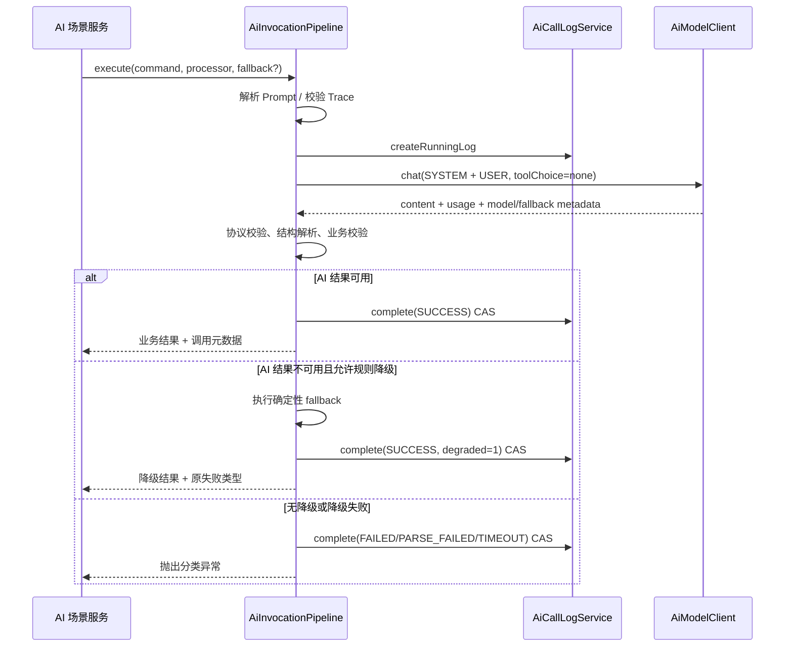
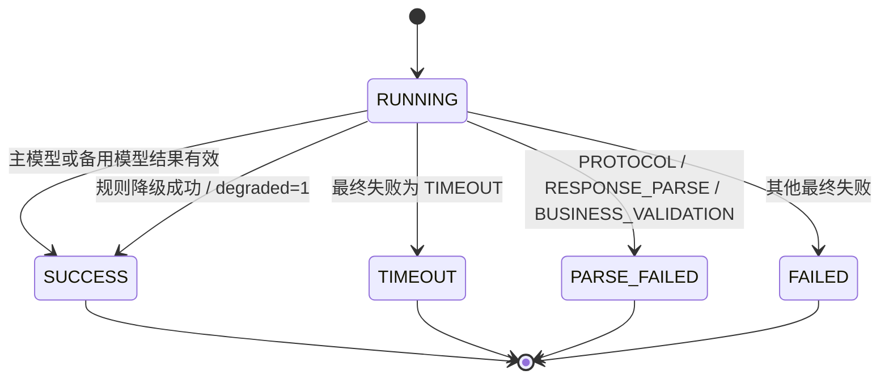

# ADR-004：Pipeline 2.0 失败分类与降级终态

状态：`ACCEPTED`
日期：2026-09-04

## 背景

WP2 已提供供应商中立的 Chat 协议，但旧 Pipeline 仍调用 `invoke(...)`，部分场景自行维护日志和降级，导致模型回退、规则降级和最终状态无法可靠区分。

## 决策

1. 所有生产 AI 场景只通过 `AiInvocationPipeline` 调用模型，Pipeline 统一使用 `AiModelClient.chat(...)`。
2. Pipeline 负责 Prompt、Trace、协议元数据、失败分类和日志生命周期；场景通过回调提供响应处理器和可选确定性降级算法。
3. 模型回退使用 `fallback_used/fallback_reason`；规则降级使用 `degraded/failure_type/degradation_reason`，两组状态相互独立。模型客户端显式携带请求模型、实际模型和主模型失败原因，禁止从重试次数推断回退。
4. 日志通过 `AiCallLogCompletionCommand` 从 `RUNNING` 以 CAS 方式进入唯一终态。
5. `SUCCESS + degraded=1` 表示 AI 失败但业务通过规则结果继续；原失败类型和安全错误信息仍保留，降级耗时计入调用总耗时。
6. 通用内部 chat 仅能使用固定 `legacy-chat` 场景、不带 Tool 的 `executeRaw`；没有登录用户时允许不创建用户日志，以保持既有内部兼容行为。

## 失败分类

模型协议错误映射为 `CONFIG/AUTH/RATE_LIMIT/NETWORK/TIMEOUT/UPSTREAM_REJECTED/UPSTREAM_SERVER/PROTOCOL/INTERNAL`；其中 WP2 的 `UPSTREAM_REJECTED` 保持兼容，Pipeline 根据可选 HTTP 状态码将 401/403 精确归类为 `AUTH`。场景处理错误映射为 `RESPONSE_PARSE` 或 `BUSINESS_VALIDATION`。

## Pipeline 2.0 时序

## 日志失败状态图

所有终态转换均带 `status=RUNNING` 条件；重复完成返回 `false`，不会覆盖首次终态。

## 边界

WP3 不注册 Tool，不实现成本、日志正文治理、HTTP Trace Filter 或 Resilience4j。场景服务拆分在 WP4 完成。
