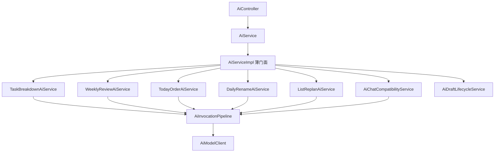

# ADR-005：AI 场景服务拆分

状态：`ACCEPTED`
日期：2026-09-04

## 背景

WP3 已把所有生产模型调用收口到 `AiInvocationPipeline`，但场景 Prompt、解析、权限、降级、草稿和事务仍集中在约 2,200 行的 `AiServiceImpl` 中。单体实现会放大修改影响面，也无法用架构规则约束场景边界。

## 决策

1. `AiController` 继续只依赖公共 `AiService`，HTTP 路由、DTO、VO 与错误码不变。
2. `AiServiceImpl` 保留为兼容门面，只注入六个场景服务和 `AiDraftLifecycleService`，所有公共方法只做委托。
3. 场景实现按任务拆解、周复盘、今日排序、日报改名、清单重排和内部 Chat 兼容能力分离；场景之间禁止互相依赖。
4. 公共响应清理、模型选择和通用草稿生命周期分别由 `AiJsonResponseSanitizer`、`AiModelSelector` 和 `AiDraftLifecycleService` 承担。
5. Prompt、业务解析、权限、规则降级和写事务归属实际场景服务；门面不持有 Mapper、权限服务、模型配置或 Pipeline。
6. 模型调用仍只能经 `AiInvocationPipeline`；任何场景直接依赖 `AiModelClient` 或 Transport 均由既有架构门禁拒绝。
7. WP4 保持当前草稿状态、确认幂等和清单重排并发语义，不提前引入 WP5 状态机、Handler 注册表或新锁策略。

## 依赖方向

## 方法迁移矩阵

| 原 `AiServiceImpl` 能力 | 唯一归属 |
|---|---|
| `chat` | `AiChatCompatibilityService` |
| `generateTaskBreakdown`、`previewTaskBreakdown`、`confirmTaskBreakdown` | `TaskBreakdownAiService` |
| `polishWeeklyReview`、`previewWeeklyPolish`、`confirmWeeklyPolish` | `WeeklyReviewAiService` |
| `recommendTodayOrder` | `TodayOrderAiService` |
| `suggestDailyReviewRename` | `DailyRenameAiService` |
| `replanListTasks`、`previewListReplan`、`confirmListReplan`、`cancelListReplan` | `ListReplanAiService` |
| `cancelDraft`、`getDraftDetail`、`expirePreviewDrafts` | `AiDraftLifecycleService` |

## 架构门禁

`AiSceneArchitectureTest` 固定以下规则：Controller 不依赖具体场景包；门面只有七个允许的协作者且不声明事务；门面不依赖 Mapper、`PermissionService`、`AiInvocationPipeline` 或 `AiProperties`；场景服务不直接依赖其他场景服务。

## 结果与边界

`AiServiceImpl` 从约 2,200 行缩减到 137 行。WP4 不新增 HTTP 接口或数据库迁移，不修改 V1～V3，不实现 RAG、Agent、日志正文治理或韧性增强。草稿状态机和统一 Handler 仍由 WP5 完成。
