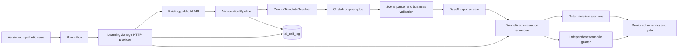

# Evaluation architecture

The provider never copies a production prompt. It invokes the same controller, permission service, prompt resolver, model client, parser, business validator, logging, and degradation path used by the application.

## Trust boundaries

- Evaluation targets must use a loopback host, a non-3306 port, and a database name ending in `_eval`.
- The database account used by the provider is read-only and is required for trace-correlated `ai_call_log` metadata plus write-integrity snapshots.
- All cases use synthetic identities and high fixed IDs. No production export is accepted.
- The grader receives synthetic input facts and the evaluated output, but never credentials or an unredacted provider request ID.
- Preview endpoints are allowed to create AI draft/audit records; before and after each Case, all columns of every project, milestone, and task row are canonicalized and SHA-256 fingerprinted. Any insert, update, logical delete, physical delete, or field mutation fails the Case even when row counts remain unchanged.
