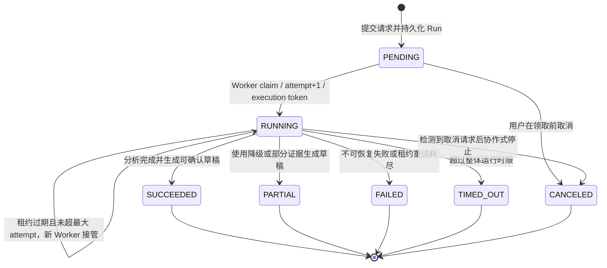
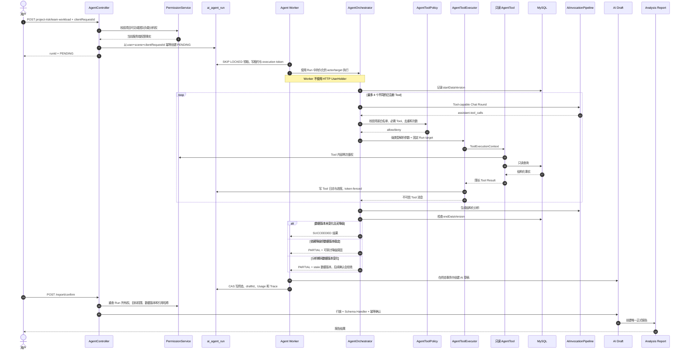
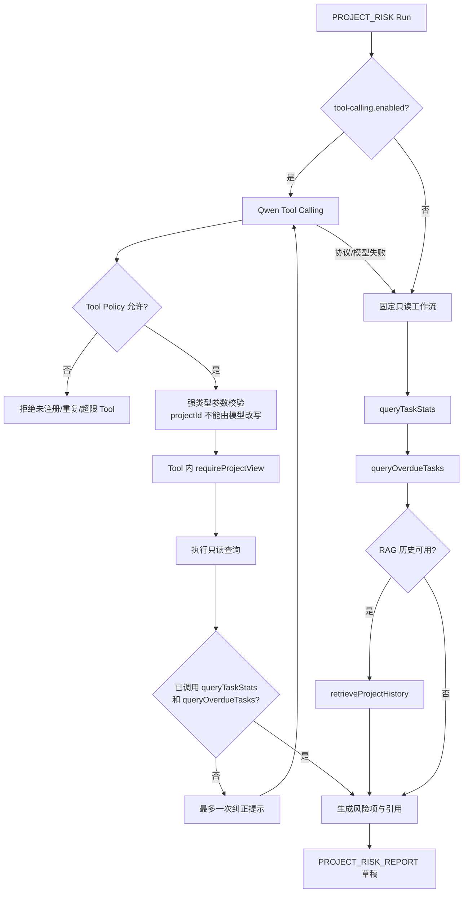
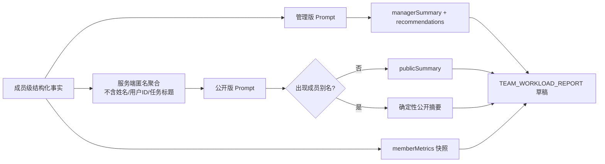

# Agent 状态机与 Tool Calling 图

## 1. 异步 Run 生命周期



`SUCCEEDED`、`PARTIAL`、`FAILED`、`TIMED_OUT`、`CANCELED` 都是不可逆终态。状态更新使用当前状态与 `execution_token` 条件更新；租约失效的旧 Worker 不能写进度、草稿或终态。

## 2. 提交、执行与确认



## 3. 项目风险 Tool Calling



项目风险允许的工具：

```text
queryProjectTasks
queryOverdueTasks
queryTaskStats
retrieveProjectHistory
```

必需工具是 `queryTaskStats` 和 `queryOverdueTasks`。历史检索不可用时仍可使用结构化任务事实完成降级分析。

## 4. 团队负载固定工作流

团队负载只允许 OWNER/ADMIN 发起，固定调用：

```text
queryTeamMemberWorkload
queryMemberOverdueTasks
```

随后使用两条隔离生成链路：



报告读取时，OWNER/ADMIN 获得管理摘要、全部成员指标和建议；MEMBER 只获得公开摘要及后端筛选出的本人指标。

## 5. 安全不变量

- Run 的 actor、projectId 和 teamId 来自持久化记录，不接受模型重选目标。
- 工具注册表中没有删除、修改、分配或批量写入能力。
- 每个 Tool 内再次执行权限检查，模型 Prompt 不能绕过。
- 同一 Tool 不允许在一次 Run 中重复调用，总次数最多 4。
- Tool 输出作为不可信文本返回模型，不能成为 System 指令。
- PENDING 可立即取消；RUNNING 在当前只读操作结束后协作式取消。
- 只有成功或部分成功的 Run 可以产生草稿；正式报告仍需用户确认。
