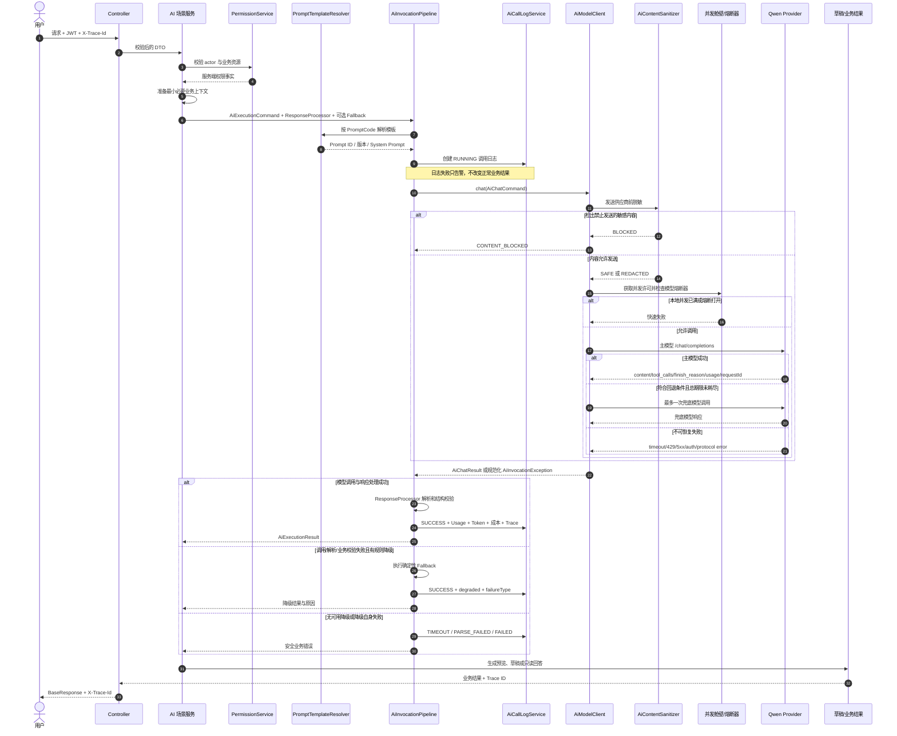
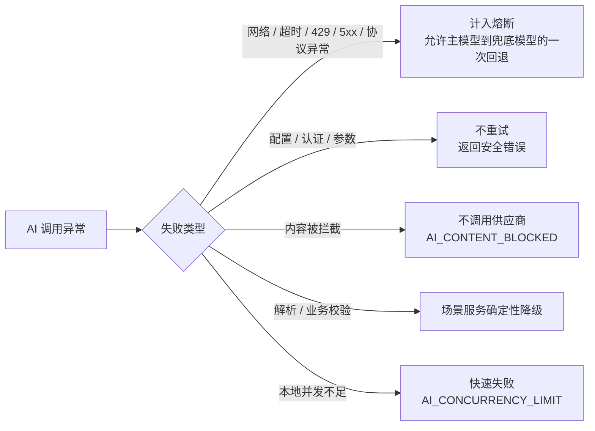

# AI 调用流程图

## 1. 统一调用链路



## 2. Tool Calling 扩展点

普通文本场景发送 `SYSTEM + USER` 消息、空 Tool 列表和 `toolChoice=none`。Agent 模型轮次通过同一 Pipeline 使用：

```text
AiChatRoundExecutionCommand
→ SYSTEM + 多轮消息 + 已注册 Tool Definition
→ AiModelClient.chat
→ assistant.tool_calls
→ 服务端 Tool Policy 和 DTO 校验
→ role=tool 结果回填下一轮
```

ModelClient 会拒绝以下响应：

- 请求未声明 Tool，但模型返回 Tool Call。
- `toolChoice=none` 时返回 Tool Call。
- 返回的函数名不在本轮声明列表中。
- 强制某个函数时返回了其他函数。

业务 Tool 是否允许执行由 Agent 层再次判断，ModelClient 只保证供应商协议边界。

## 3. 正文、Trace 和成本策略

| 场景 | 正文日志策略 | 说明 |
|---|---|---|
| 普通 AI 场景 | `DEFAULT` | 脱敏、截断后保存允许的诊断正文和哈希 |
| RAG | `METADATA_ONLY` | 不保存问题、证据和答案正文 |
| Agent 模型轮次 | `METADATA_ONLY` | 只记录 Run、轮次、模型、Usage 和状态 |

- Trace 优先使用命令显式值，其次使用 HTTP/MDC 上下文，否则生成随机值。
- Usage 缺失或价格目录不完整时成本保持未知，不伪造为 0。
- 主模型和兜底模型按各自 Usage 与价格版本分别计价后聚合。
- 请求正文默认上限 8,000 字符，错误摘要默认上限 2,000 字符。
- 正式业务写入不属于 Pipeline；任务拆解和 Agent 报告都先生成草稿。

## 4. 失败分类


