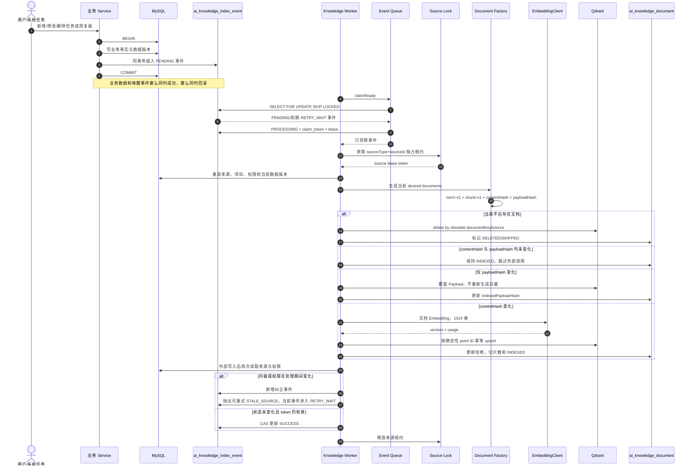
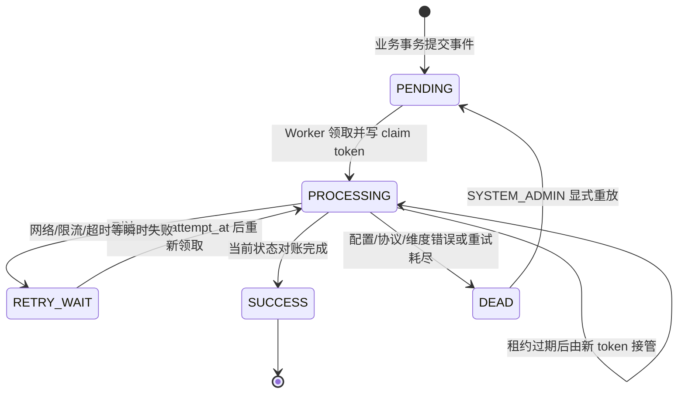
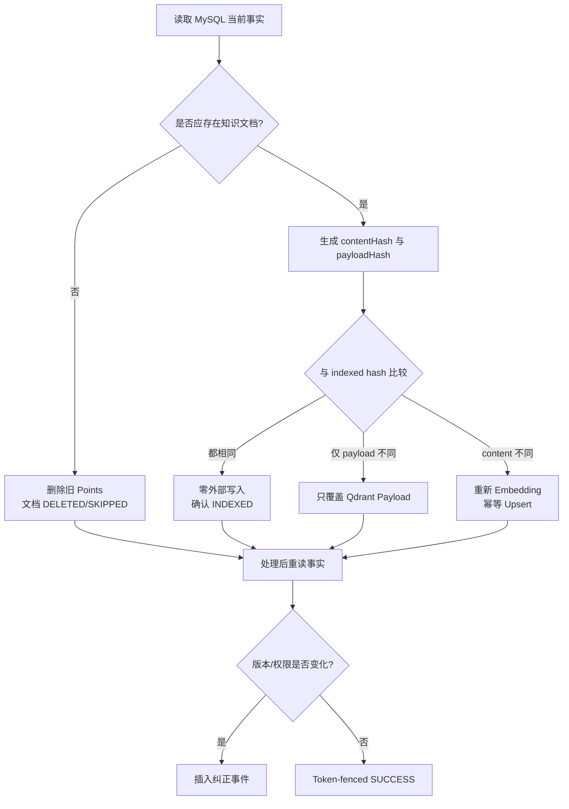

# Outbox 与索引一致性图

## 1. 写入与异步对账



## 2. 事件状态机



旧 Worker 的 `claim_token` 已失效时，不能更新事件终态。来源在处理期间变化时，纠正事件和当前事件的重试共同保证后续再次对账，而不是把旧写入标记为已经收敛。`worker-enabled=false` 只停止消费，不停止业务事务写 Outbox，因此重新启用后不会漏掉期间变化。

## 3. 文档状态与哈希决策



哈希定义：

```text
contentHash = SHA-256(normalizerVersion + chunkingVersion + canonicalText)
payloadHash = SHA-256(canonical JSON payload)
sourceVersion = contentHash + ":" + payloadHash
```

## 4. 可见性和内容边界

| 来源 | 生成的知识文档 |
|---|---|
| 个人项目任务 | 项目所有者 PRIVATE 文档 |
| 团队项目任务 | 团队范围 TEAM 文档 |
| PRIVATE 周复盘 | 作者仍有项目权限时生成作者 PRIVATE 文档 |
| TEAM 周复盘 | 作者 PRIVATE 文档 + 只含 `sharedSummary` 的 TEAM 文档 |
| 删除/失效来源 | 不存在 ACTIVE 文档，删除旧 Points |

任务语义正文只包含标题与描述；状态、优先级、截止日、受理人和权限范围进入 Payload。这样仅运营字段变化时无需支付新的 Embedding 成本。

## 5. Backfill 与恢复

- INITIAL、REBUILD 和增量事件最终都进入同一套对账逻辑，避免出现第二种写向量语义。
- Backfill 使用可恢复的 Keyset 游标和独立 Run；父 Run 等待所有子事件达到终态。
- Qdrant 不是备份。Collection 丢失或模型/维度升级时，从 MySQL 重新生成并通过 Alias 切换。
- DEAD 事件不被生命周期任务自动删除，必须由 SYSTEM_ADMIN 排查后重放。
