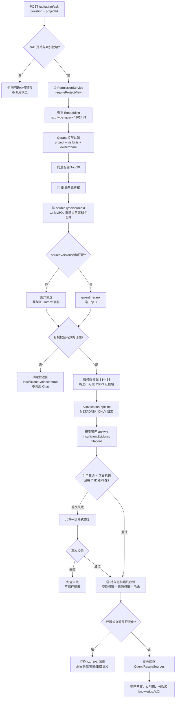
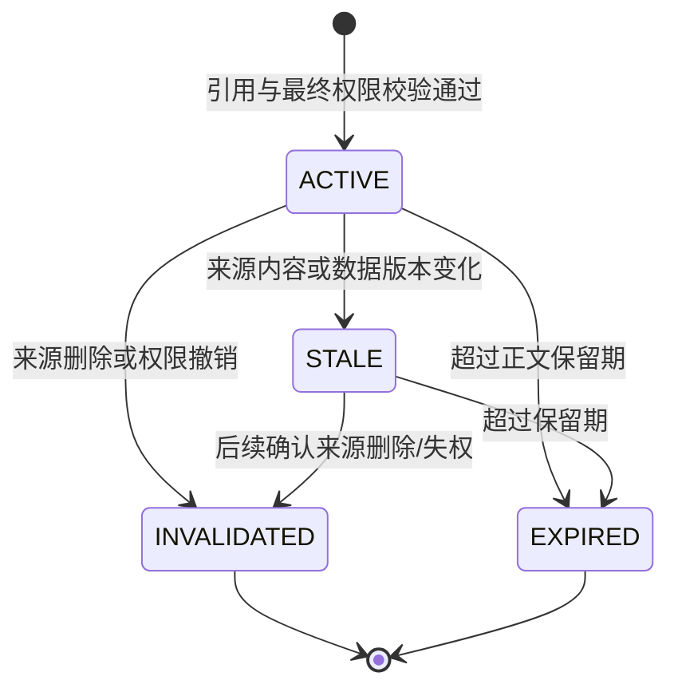

# RAG 检索和引用图

## 1. 权限感知检索主流程



## 2. 三道权限防线

| 防线 | 时点 | 作用 |
|---|---|---|
| 第一道 | 任何供应商调用前 | 确认用户当前可查看项目，越权问题不会发送到外部服务 |
| 第二道 | Qdrant 召回后 | 批量校验任务/复盘权限，并从 MySQL 重建正文；Qdrant Payload 不作为业务事实 |
| 第三道 | 保存与返回前 | 防止模型生成期间发生退团、删除、改权或内容更新 |

个人项目只查询 `PRIVATE + ownerUserId`。团队项目查询当前团队的 `TEAM` 文档，以及请求者本人在该项目下的 `PRIVATE` 文档。

## 3. 证据与引用合同

服务端给最终证据分配临时编号，模型只能引用编号，不能提交业务 ID：

```json
{
  "evidence": [
    {"id": "S1", "title": "任务标题", "text": "不可信证据正文"},
    {"id": "S2", "title": "第 36 周共享复盘", "text": "不可信证据正文"}
  ]
}
```

模型必须返回：

```json
{
  "answer": "主要延期来自两个未完成任务 [S1]，共享复盘也记录了阻塞 [S2]。",
  "insufficientEvidence": false,
  "citations": ["S1", "S2"]
}
```

后端验证：

- `citations` 集合必须与答案中的 `[Sx]` 标记完全一致。
- 每个编号必须存在于最终 Top 8 证据中。
- 业务 `sourceId` 由服务端从编号映射，模型无法伪造。
- 没有授权候选时不调用 Chat，直接返回依据不足。
- RAG 调用日志只保存编号、哈希、Usage 和状态，不保存问题、证据或答案正文。

## 4. 结果生命周期



`GET /api/ai/rag/result/{requestId}` 每次重新检查结果所有者、项目权限和引用版本：

- `ACTIVE`：返回答案和当前仍有效的引用。
- `STALE`：返回状态与引用元数据，答案为 `null`，提示重新生成。
- `INVALIDATED`、`EXPIRED`：返回专用业务错误，不返回正文。

## 5. 降级边界

- Rerank 不可用时可以按向量顺序返回，并明确 `degraded=true`。
- Embedding 或 Qdrant 不可用时不能绕过检索生成答案。
- 引用格式修复最多一次，第二次失败不持久化结果。
- 当前版本不包含聊天历史、问题改写、文件摄取或混合关键词检索。
