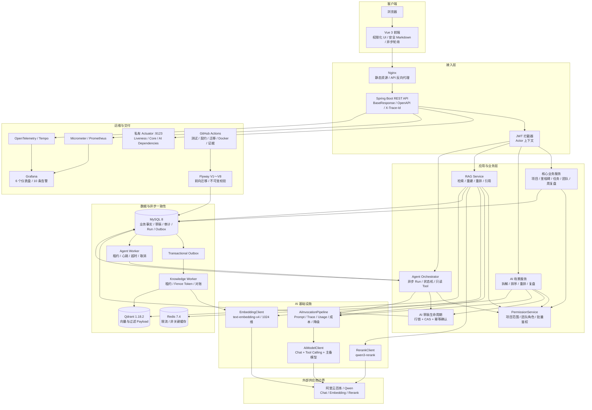
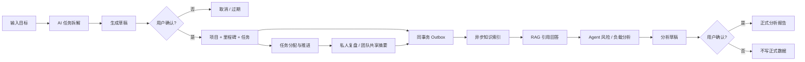

# LearningManage 系统架构图

## 1. 架构目标

LearningManage 是一个 AI 原生项目与学习管理系统。系统保留项目、里程碑、任务、团队和周复盘等确定性业务能力，在统一权限边界之上增加受治理的 AI 生成、可重建知识索引、权限感知 RAG 和只读 Agent。

核心原则：

- MySQL 是唯一业务事实来源，Qdrant 是可删除、可重建的派生索引。
- 所有资源访问通过 `PermissionService`，`SYSTEM_ADMIN` 不自动获得私人业务数据访问权。
- 所有模型调用通过 `AiInvocationPipeline`，统一处理 Prompt、日志、用量、失败和降级。
- AI 写操作只生成草稿，必须由用户确认后才能写入正式业务表。
- RAG 来源和 Tool 输出都是不可信输入，必须重建、鉴权、限长和校验。
- Redis、Qdrant、模型或可观测组件故障不能改变核心业务 Readiness。

## 2. 总体架构

## 3. 关键业务链路

## 4. 分层职责

| 层次 | 主要职责 | 明确不负责 |
|---|---|---|
| Controller | 参数校验、认证入口、统一响应 | 资源权限规则和模型协议 |
| 业务/场景 Service | 用例编排、事务、业务校验和规则降级 | 供应商 HTTP 细节 |
| PermissionService | 根据服务端事实计算资源权限 | 接受客户端角色或能力声明 |
| AiInvocationPipeline | Prompt、模型调用、日志终态、Usage、失败分类 | 项目/任务权限和正式写入 |
| Model/Embedding/Rerank Client | 供应商协议、超时、主备模型与响应解析 | 业务授权和业务结果判断 |
| Knowledge Worker | 根据 MySQL 当前状态对账 Qdrant | 把事件正文当作事实快照 |
| RAG Service | 三次鉴权、来源重建、重排和证据校验 | 信任 Qdrant Payload 正文 |
| Agent | 受控调用场景白名单中的只读 Tool | 动态注册 Tool 或直接修改业务数据 |
| 运维层 | 健康、指标、追踪、保留和受控清理 | 向普通用户暴露平台级数据 |

## 5. 部署和故障边界

- 公共业务 API 使用应用端口；Actuator 使用不映射到宿主机的私有管理端口 `9123`。
- MySQL 故障使 Core Readiness 为 `DOWN`；Redis、Qdrant、模型和遥测故障只使 AI 依赖状态为 `DEGRADED`。
- RAG、Agent、Agent Worker、Knowledge Worker 均有独立功能开关，默认安全关闭后再按环境启用。
- Qdrant 丢失后通过 MySQL 文档元数据和幂等 Backfill 重建；Redis 丢失不影响正式业务事实。
- 数据库结构只通过 Flyway 前向迁移，应用账号保持 DML-only。

## 6. 当前交付状态

- 阶段 5 RAG 已实现并验证，但按项目决策不单独创建 Release。
- 阶段 7 已通过本地迁移、Docker、故障演练、指标和 Trace 验收，并发布为 `stage7-v1.0.0`；受保护的真实 Qwen 可观测性验证在发布时由用户显式豁免，不能表述为通过。
