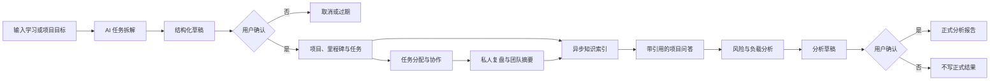
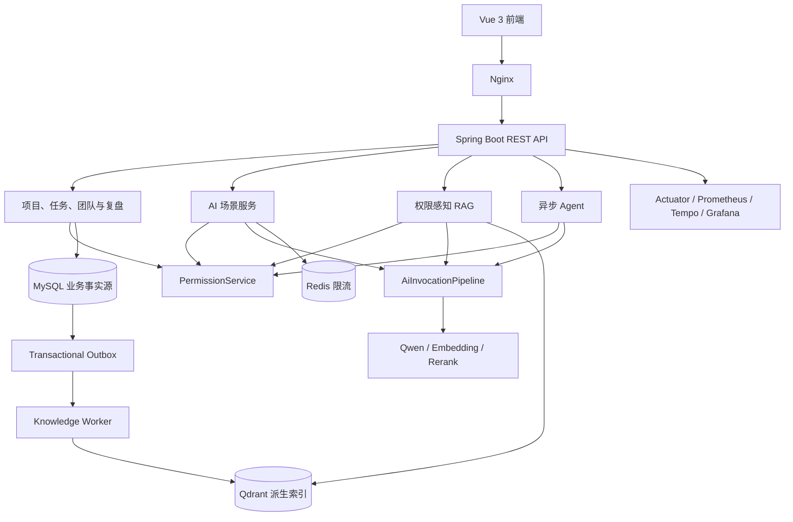

# LearningManage 项目总结

> 文档用途：项目答辩、作品集展示、面试前置材料与仓库概览 
> 事实基线：2026-09-08 
> 项目形态：模块化单体、前后端分离、受治理的 AI 应用

## 一、项目概述

LearningManage 是一个面向个人和小团队的 AI 项目与学习管理系统。系统以用户、团队、项目、里程碑、任务和周复盘为业务底座，在统一权限模型之上提供 AI 任务拆解、今日任务排序、清单重排、任务改名和周复盘润色，并进一步实现了权限感知 RAG、项目风险分析 Agent 和团队负载分析 Agent。

这个项目关注的重点不是单纯“接入一个大模型”，而是解决 AI 进入真实多用户业务系统后出现的工程问题：模型能读取哪些数据、向量索引如何与业务事实保持一致、回答引用能否验证、Agent 是否可能越权或误写数据，以及外部 AI 依赖失败时核心业务能否继续运行。

因此，项目最终形成的是一条从业务数据产生、AI 辅助生成、知识沉淀、检索问答、Agent 分析，到用户确认正式结果的完整闭环。

## 二、业务价值与核心流程

系统覆盖个人学习规划和小团队项目协作两类场景：

- 用户可以把一个模糊目标交给 AI，获得“项目—里程碑—任务”结构化草稿，确认后再创建正式数据。
- 团队 OWNER 和 ADMIN 可以管理项目、分配任务和查看负载，成员按照权限推进任务；任务转派和成员退出均有一致性控制与审计记录。
- 用户可以记录私人周复盘，并按需另行填写团队共享摘要，避免私人反思因团队协作或知识索引而泄漏。
- 任务与复盘会异步进入项目知识索引，用户可以在项目范围内提问并获得带来源引用的回答。
- 系统可以异步分析项目风险和团队工作负载，但 Agent 只生成分析草稿，用户确认后才形成正式报告。

主业务闭环如下：

## 三、系统架构

项目采用 Spring Boot 模块化单体和经典分层架构。前端通过 Nginx 访问 REST API，MySQL 保存全部正式业务事实，Redis 承担 AI 场景限流，Qdrant 保存可重建的向量索引，阿里云百炼提供 Qwen Chat、Embedding 和 Rerank 能力。

主要技术栈包括 Java 17、Spring Boot 3.3.6、MyBatis Plus 3.5.7、MySQL 8、Redis、Qdrant 1.18.2、Vue 3、Nginx、Flyway、Resilience4j、Micrometer、OpenTelemetry、Prometheus、Grafana 和 Tempo。

数据库通过 Flyway V1～V8 前向迁移。Docker Compose 部署包含 MySQL、Redis、Qdrant、后端、Nginx 前端、Prometheus、Tempo 和 Grafana。RAG、知识索引 Worker、Agent、Agent Worker 和数据清理均可独立启停，默认按安全策略关闭后再逐步启用。

## 四、核心技术设计

### 1. 统一权限与人工确认

系统没有把权限判断散落在 Controller，也不信任客户端提交的角色或资源归属，而是通过 `PermissionService` 根据当前用户、项目类型、有效团队关系、任务受理人和复盘可见性统一计算权限。

这条权限边界同时覆盖普通业务、AI 输入、RAG 候选、Agent Tool、草稿确认和历史结果读取。平台 `SYSTEM_ADMIN` 只获得脱敏运维能力，不会自动获得用户私人项目和复盘的读取权。

所有可能影响正式业务的 AI 场景均遵循“预览或分析 → 草稿 → 用户确认 → 正式写入”。确认阶段会重新检查草稿归属、当前权限、状态和业务数据版本，并通过操作 ID、唯一约束或条件更新保证幂等，从而避免重复确认、权限变化和旧结果覆盖新数据。

### 2. 以 MySQL 为事实源的知识索引

任务或复盘变化时，业务数据与索引事件在同一个 MySQL 事务中提交。Knowledge Worker 使用 `SELECT FOR UPDATE SKIP LOCKED`、租约和 claim token 领取事件，然后重新读取 MySQL 当前状态，生成规范化文档、内容哈希和权限 Payload，再幂等写入 Qdrant。

Outbox 事件只表示“这个来源需要重新对账”，不携带可长期信任的业务快照。正文变化时重新生成 Embedding；只有状态、截止时间、受理人或权限 Payload 变化时只更新 Payload；全部未变化时跳过外部写入。Worker 写入后还会再次读取来源，发现处理期间发生变化就创建纠正事件。

因此，MySQL 始终是唯一业务事实源，Qdrant 只是可删除、可回填、可重建的派生索引。外部向量库短暂不可用不会导致业务变更丢失。

### 3. 可验证 RAG 与受控 Agent

RAG 当前提供单项目、单轮问答。查询前先检查项目权限；Qdrant 按项目和可见性召回候选后，系统会批量复核来源权限，并从 MySQL 重建当前正文和校验版本；候选经 Rerank 后最多保留 8 条，使用服务端临时编号 `S1`～`S8` 交给模型。回答生成后还要再次检查权限、内容哈希和引用集合，失权、删除或过期的历史结果不会继续返回正文。

Agent 采用持久化异步 Run，而不是简单的进程内异步任务。Worker 通过租约、心跳和 execution token 支持超时、取消和崩溃接管，旧 Worker 失去租约后不能覆盖新结果。项目风险 Agent 可以进行 Qwen Tool Calling，团队负载使用固定工作流；所有 Tool 都必须预先注册、按场景列入白名单、使用强类型参数、限制调用次数，并在 Tool 内再次鉴权。

Agent 只拥有读取任务、统计、逾期信息和项目历史的工具，不具备新增、修改、删除或分配业务资源的能力。Tool Calling 不可用时可以降级到固定只读工作流，部分依赖不可用时返回可审计的 `PARTIAL` 结果，而不是把不完整分析伪装成完整结论。

## 五、AI 调用治理与生产能力

所有模型调用统一经过 `AiInvocationPipeline`，由它处理 Prompt 版本、调用日志、Trace、模型选择、Usage、Token、成本估算、超时、并发舱壁、熔断和主备模型回退。业务场景负责资源权限、响应解析、业务校验和确定性降级，供应商 HTTP 协议不会散落在各个 Service 中。

RAG 和 Agent 默认只记录元数据，不把问题、证据、Tool 输出和答案正文写入通用 AI 日志。运行指标使用低基数标签，不以用户 ID、项目 ID、Run ID 或 Trace ID 作为指标维度。

生产治理方面，系统提供：

- 公共兼容健康检查，以及独立的 Liveness、Core Readiness 和 AI Dependencies；
- Prometheus 指标、Grafana 仪表盘与告警、OpenTelemetry/Tempo Trace；
- 面向 `SYSTEM_ADMIN` 的脱敏 AI 运维视图、知识索引管理和 DEAD 事件重放；
- 可恢复的数据清理 Run，正式清理前必须绑定成功的 Dry Run；
- MySQL 核心依赖与 Redis、Qdrant、模型、遥测等可降级依赖的故障隔离。

## 六、工程验证结果

项目通过单元测试、MySQL 集成测试、架构约束测试、前后端 OpenAPI 契约、Docker 应用路径评测和故障演练形成验证闭环。截至事实基线日期，可安全引用的结果包括：

| 验证范围 | 当前结果 |
|---|---|
| Flyway | 空库 V1→V8 与存量 V7→V8 均验证通过，最终为 39 张表 |
| RAG 应用路径 | 50/50 个检索、权限与引用用例通过，并完成真实 Embedding、Rerank、Qdrant 和 Qwen 受保护链路验证 |
| Agent 应用路径 | 100/100 个确定性用例通过，覆盖项目风险、团队负载、未注册 Tool 注入和受控失败；未创建正式报告 |
| Stage 7 后端本地验收 | 三个验证分区分别为 803/803、61/61、5/5 |
| 前端本地验收 | 502/502；前端使用的 60 个 OpenAPI 操作全部匹配，缺失为 0 |
| 可观测性 | Prometheus 1/1 Target UP，6 个 Grafana 仪表盘、10 条告警规则，Tempo 返回 20 条验证 Trace |
| 故障演练 | MySQL 故障正确影响核心就绪；Redis、Qdrant、Prometheus 和 Tempo 故障不拖垮核心业务，并可恢复 |

这些结果主要证明协议、权限、一致性、安全边界、异常路径和部署链路符合设计。确定性 Stub 评测和真实供应商链路冒烟不能代替完整真实模型语义质量评估。

## 七、当前状态与能力边界

截至 2026-09-08：

- Stage 6 受控异步 Agent 已发布为 `stage6-v1.0.0`。
- Stage 5 RAG 已实现并验证，但项目明确决定不单独创建 Stage 5 Release。
- Stage 7 生产治理、可观测性与数据生命周期已发布为 `stage7-v1.0.0`。发布记录中的真实 Qwen 可观测性验证由用户显式豁免，未执行且不能表述为通过。
- Stage 3 的完整真实模型盲测、聚合评分和人工语义复核仍是最终验收待办，不能使用离线确定性结果替代。

系统当前不包含文件上传知识库、多轮通用聊天、混合关键词检索、多 Agent 协作，也不允许 Agent 自动修改项目或任务。RAG 仍是单项目、单轮问答；AI、RAG、Agent 等增强能力可以降级或关闭，但项目、任务和团队等核心业务应继续可用。

## 八、总结

LearningManage 的价值不在于功能数量，而在于把 AI 能力放进了明确的业务和安全边界中：统一权限和人工确认防止越权与误写，Transactional Outbox 和 Fence Token 保证索引最终一致，证据化 RAG 让回答可以复核，只读 Tool 与持久化 Run 让 Agent 可以控制、恢复和审计，可观测性与故障隔离则保证 AI 依赖不会反向拖垮核心业务。

它完整展示了一个 Spring Boot 多用户业务系统如何把大模型能力从“可演示”推进到“可测试、可追踪、可降级、可运维”的工程实现。

## 延伸材料

- [系统架构图](../architecture/system-architecture.md)
- [权限矩阵](../authorization/permission-matrix.md)
- [AI 调用流程图](../architecture/ai-invocation-flow.md)
- [Outbox 与索引一致性图](../architecture/outbox-index-consistency.md)
- [RAG 检索和引用图](../architecture/rag-retrieval-and-citation.md)
- [Agent 状态机与 Tool Calling 图](../architecture/agent-state-and-tool-calling.md)
- [1、3、10 分钟项目介绍](project-introductions.md)
- [Stage 7 正式 Release](https://github.com/Zhi-Hua-Yuan/LearningManage/releases/tag/stage7-v1.0.0)
